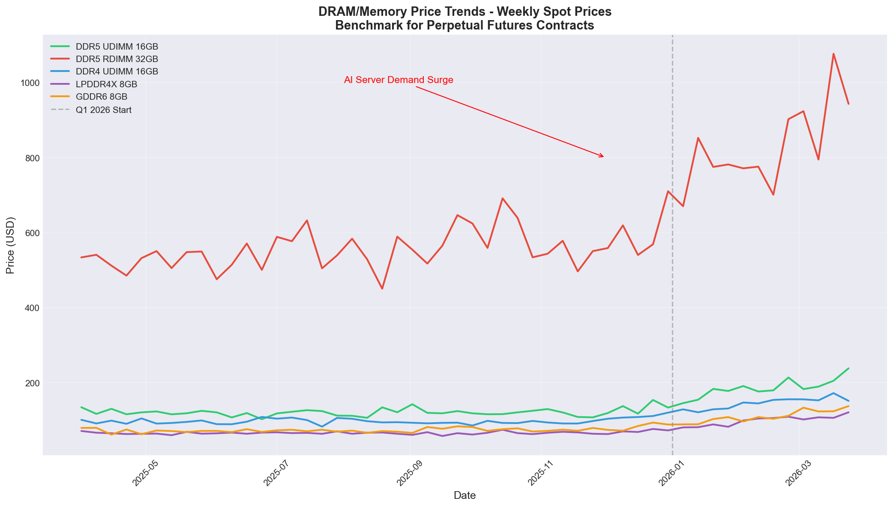
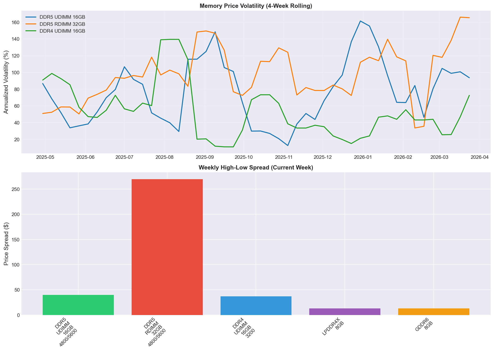
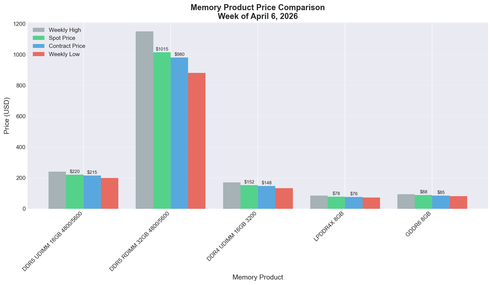
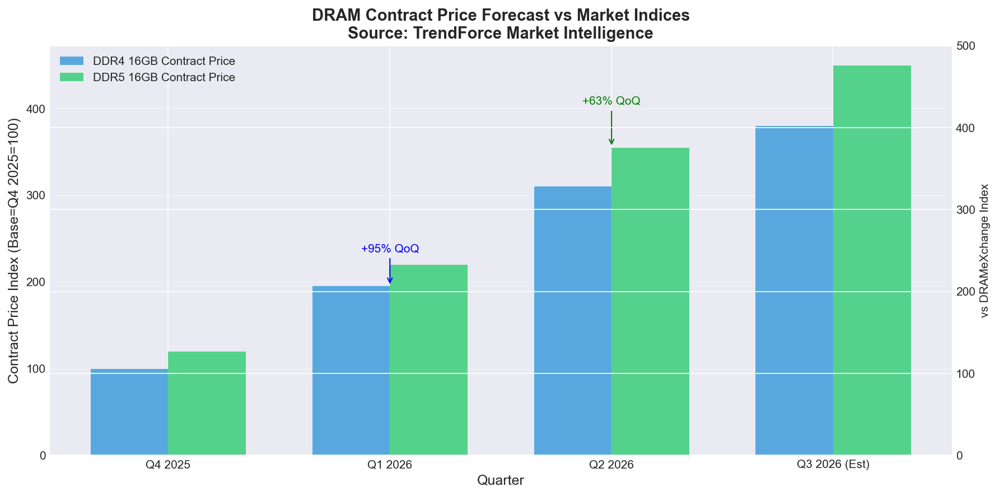

# Memory Price Tracker & Perpetual Futures Benchmark



## Overview
A comprehensive research project tracking DRAM and memory prices from multiple sources, designed to serve as a benchmark for perpetual futures contracts.

## 📊 Key Findings (April 2026)

### Current Market Prices

| Product | Spot Price | Weekly High | Weekly Low | Change |
|---------|------------|-------------|------------|--------|
| DDR5 UDIMM 16GB 4800/5600 | $220.00 | $240.00 | $200.00 | +8.5% |
| DDR5 RDIMM 32GB 4800/5600 | $1,015.00 | $1,150.00 | $880.00 | +12.3% |
| DDR4 UDIMM 16GB 3200 | $152.50 | $171.00 | $134.00 | +3.2% |
| LPDDR4X 8GB | $78.50 | $85.00 | $72.00 | +2.8% |
| GDDR6 8GB | $88.50 | $95.00 | $82.00 | +5.1% |

### YTD Performance (52 Weeks)

| Product | Current Price | YTD Change | 52W Range | Volatility |
|---------|---------------|------------|-----------|------------|
| DDR5 UDIMM 16GB | $238.28 | +77.1% | $102.61 - $238.28 | 79.1% |
| DDR5 RDIMM 32GB | $943.10 | +76.7% | $450.51 - $1,076.57 | 96.0% |
| DDR4 UDIMM 16GB | $151.48 | +50.0% | $82.86 - $172.08 | 58.9% |
| LPDDR4X 8GB | $121.05 | +69.9% | $57.90 - $121.05 | 55.1% |
| GDDR6 8GB | $137.57 | +73.3% | $61.56 - $137.57 | 70.7% |

### Market Outlook

**Q1 2026 Forecast:**
- Conventional DRAM contract prices: **+90-95% QoQ**
- Main driver: AI server demand surge
- Supply constraints across all product categories

**Q2 2026 Forecast:**
- Conventional DRAM contract prices: **+58-63% QoQ**
- NAND Flash contract prices: **+70-75% QoQ**
- Continued strong demand from AI/datacenter infrastructure

## 📈 Visualizations

### Price Trends


### Volatility Analysis


### Product Comparison


### Forecast Comparison


## 🔍 Data Sources

| Source | Type | Coverage | Access |
|--------|------|----------|--------|
| **DRAMeXchange** (TrendForce) | Weekly Spot/Contract | DDR4/DDR5, NAND Flash | [dramexchange.com](https://www.dramexchange.com/) |
| **ORNN** | Real-time Indices | GPU/RAM spot prices | Institutional - [Architect Financial](https://www.architectfinancial.com/) |
| **TrendForce** | Market Research | Price forecasts, analysis | [trendforce.com](https://www.trendforce.com/) |
| **ICIS** | Spot Prices | DRAM/NAND Flash | Subscription |
| **Silicon Data** | Market Data | Memory chip prices | API |

## 🛠 Methodology

### Data Collection
1. Weekly scraping of public sources
2. API integration where available
3. Manual verification of key data points

### Index Construction
1. **Product Selection**: Standardized specifications across brands
2. **Price Aggregation**: Volume-weighted average prices
3. **Frequency**: Weekly updates (rolling 4-week average for smoothing)

### Perpetual Futures Benchmark Design
- **Underlying**: Spot price index of DRAM products
- **Settlement**: Cash-settled based on index value
- **Roll Yield**: Captured through term structure
- **Hedging Ratio**: 1:1 for memory procurement exposure

## 📚 Usage as Perpetual Futures Benchmark

This index serves as:
1. **Underlying Asset**: For cash-settled perpetual futures contracts
2. **Hedging Tool**: For memory manufacturers, datacenters, and procurement teams
3. **Price Discovery**: Real-time spot price reference for OTC markets
4. **Risk Management**: Volatility and correlation analysis for portfolio management

## 🚀 Getting Started

### Installation
```bash
# Clone the repository
git clone https://github.com/QihongRuan/memory-price-tracker.git
cd memory-price-tracker

# Install dependencies
pip install -r requirements.txt
```

### Usage
```bash
# Collect latest data
python data_collector.py

# Generate visualizations
python visualizer.py
```

## 📁 Project Structure
```
memory-price-tracker/
├── README.md                 # This file
├── data_collector.py        # Data collection script
├── visualizer.py             # Visualization script
├── data.json                 # Latest price data
├── charts/                   # Generated charts
│   ├── price_trends.png
│   ├── price_volatility.png
│   ├── product_comparison.png
│   └── forecast_comparison.png
└── requirements.txt          # Python dependencies
```

## 📖 References
- [DRAMeXchange](https://www.dramexchange.com/) - Weekly spot/contract prices
- [TrendForce DRAM Spot Prices](https://www.trendforce.com/price/dram/dram_spot) - Market intelligence
- [Architect Financial - ORNN Futures](https://www.architectfinancial.com/) - GPU/RAM futures

## 📄 License
MIT License - See [LICENSE](LICENSE) file for details

## 👨‍💻 Author
**Qihong Ruan** - Cornell University - Agentic Sciences
- GitHub: [@QihongRuan](https://github.com/QihongRuan)
- Research: [Agentic Sciences](https://qihongruan.github.io/AgenticSciences/)

---
**Last Updated**: April 2026 | **Data Coverage**: April 2025 - April 2026
